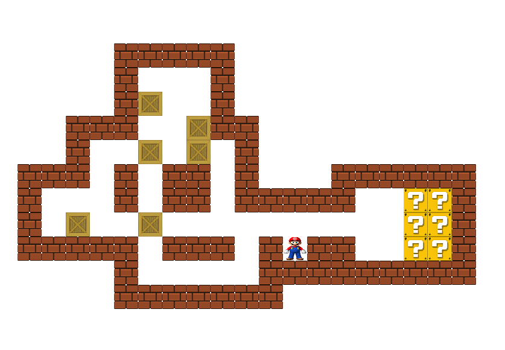
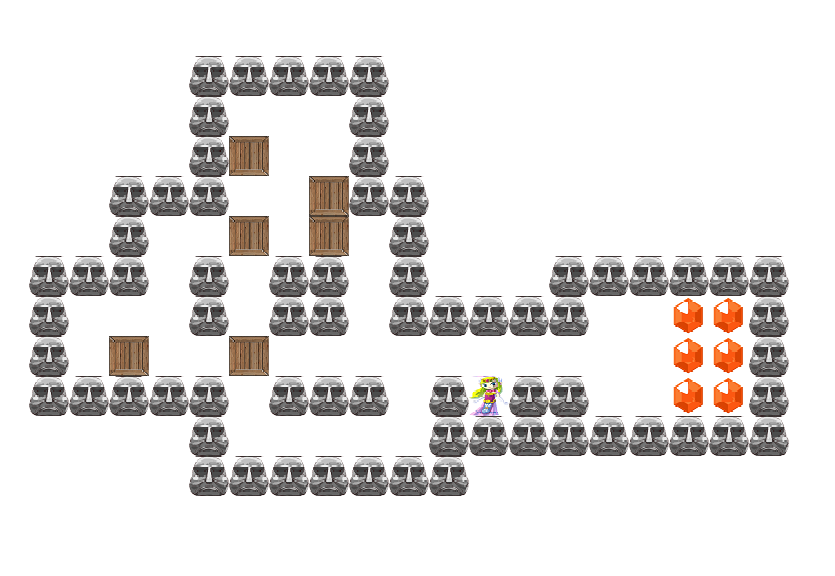
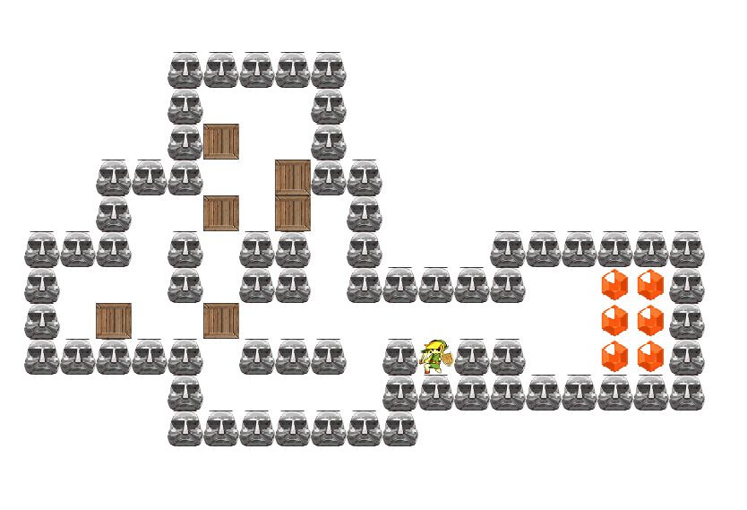

# 

[Sokoban](https://sokoban.info/) is a puzzle game invented in Japan. The objective of the game is to push crates to their proper locations with minimum number of moves.

This project was done for Computer Laboratories I at **Universidade do Minho** using [**Haskell**](https://www.haskell.org/).

## Usage

The game have different themes:

- Classic

- Mario

- Luigi

- Zelda

- Link 


The game have 5 different levels for now, but you can add more levels. The create a map follow this tips:
- create a text file
- '#' corresponds to a wall block
- '.' corresponds where should be the final places of the crates
- after draw the map the first line should have the initial coordenates(first height, second width, starts from the left inferior corner of the map witch corresponds to the position 0 0) of the player
- after that should have in each line the coordinates of each crate(with same caracteristics of player coordinates)
- save the map in levels folder, but **be careful** to not overwrite levels already added/present to the folder
- the game on loading time checks if the map is valid, if not the game will output the line where is the error

Example of a map:
```
###################
#####   ###########
#####   ###########
#####   ###########
###      ##########
### # ## ##########
#   # ## #####  ..#
#               ..#
##### ### # ##  ..#
#####     #########
###################
11 2
5 8
7 7
5 6
7 6
2 3
5 3
```

Result of this map:


During a level you can:
- restart: pressing 'r'
- undo: pressing 'u'
- go to prev level: pressing 'b'
- go to next level: pressing 'n'

## Setup

### Dependencies

- [OpenGL](https://www.opengl.org/about/)
- [freeGLUT](http://freeglut.sourceforge.net/)
- [stack](https://docs.haskellstack.org/en/stable/README/)

### Build

- clone the repository
- run install.sh

### Run

After building go to the *build* folder(inside the cloned folder) and run *Sokoban* executable file in command line: `./Sokoban`

## License

Licensed under the MIT License, see [LICENSE.md](LICENSE) for more details.
